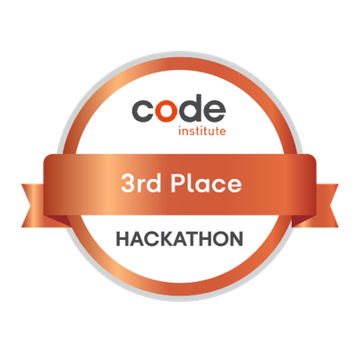

## HAVEN - (Humanitarian Action for Vigilance Empowerment and Notification)
[View our live project](https://mikael-johnsson.github.io/hack-jan25-team3)

## Table of Contents

* [Criteria](#criteria)
* [UXD (User Experience Design) ](#user-experience-ux)
    * [User Stories](#user-stories)
* [Design](#design)
* [Features](#features)
* [Goal](#goal)
* [Problem Statement](#problem-statement)
* [Target Audience](#target-audience)
* [Benefits](#Benefits)
* [Submission](#submission)
* [Deployment](#deployment)
* [Future Features](#future-features)
* [Testing](#testing)
* [Credits](#credits)
* [Team](#team)

---

### **Criteria**

1. **Purpose and Focus:**  This app provides a basic API for the team's hackathon project's user interface. The focus for the MVP is to provide a set of POST and GET routes to store reports and reporter information and to return full lists of the two tables. There is also a small set of routes that can be used to test the database connection.

2. **Team Collaboration:**
   Ensure that the project reflects the [contributor's work](#contributors).

[Back to Table of Contents](#table-of-contents)

---

## User Experience (UX)

### Primary Goal

The primary goal is to create a basic API that can be used to store and retrieve information about incident reports form the project's UI.
It must be easy to use and accepts and returns the expected data.

[Back to Table of Contents](#table-of-contents)

---

## User Stories

User Stories
  

### User Story: Stores reports in the database
**Label:** Must Have
> **As a** user,
> **I want to** be able to report an incident,
> **so that** the authorities could be notified.
### Acceptance Criteria:
- Must accept a JSON request.
- Must return a JSON response.
- Must return a status in the response.
- Must return a message in the response.
- Must return the last insert in the response.
---

### User Story: Stores reporters in the database
**Label:** Must Have
> **As a** user,
> **I want to** be able to store my contact details,
> **so that** I can be contacted in the future for updates or more information.
### Acceptance Criteria:
- Must accept a JSON request.
- Must return a JSON response.
- Must return a status in the response.
- Must return a message in the response.
- Must return the last insert in the response.
---

### User Story: Returns a list of reporters from the database
**Label:** Must Have
> **As a** UI developer,
> **I want to** be able to get a full list of reports table results,
> **so that** I can use the data in the UI.
### Acceptance Criteria:
- Must return a JSON response.
- Must return a status in the response.
- Must return a message in the response.
- Must return the full amount of rows from the reporters table.
---

### User Story: Returns a list of reports from the database
**Label:** Must Have
> **As a** UI developer,
> **I want to** be able to get a full list of reporters table results,
> **so that** I can use the data in the UI.
### Acceptance Criteria:
- Must return a JSON response.
- Must return a status in the response.
- Must return a message in the response.
- Must return the full amount of rows from the reports table.
---

### User Story: Returns a success or error message with each set of results
**Label:** Must Have
> **As a** UI developer,
> **I want to** get a success or error message from the API response,
> **so that** I can correctly parse data.
### Acceptance Criteria:
- Must return a JSON response.
- Must return a status in the response.
- Must return a message in the response.
---

### User Story: Returns a test message on calling a test route
**Label:** Must Have
> **As a** UI developer,
> **I want to** be able to call a test route in the API,
> **so that** I can confirm database connection.
### Acceptance Criteria:
- Must return a JSON response.
- Must return a status in the response.
- Must return a message in the response.
---

### User Story: Favicons and title
**Label:** Setup

---

 

[Back to Table of Contents](#table-of-contents)

---

# Design
The API includes the following routes:
## POST /api/*
> Returns: { status: STRING, message: STRING }
### POST /api/reports
> Accepts: { location: STRING, description: STRING }
> Returns: { insertId: INT}
### POST /api/reporters
> Accepts: { firstName: STRING, lastName: STRING, email: STRING, phone: STRING, howCanHelp: STRING, reportId: INT }
> Returns: { insertId: INT}
### GET /api/reports
> Returns: [{location: STRING, description: STRING, id: INT}]
### GET /api/reporters
> Returns: [{ firstName: STRING, lastName: STRING, email: STRING, phone: STRING, howCanHelp: STRING, reportId: INT]
### GET /api/test
> Returns: { status: STRING, message: STRING, dataReceived: STRING }
---

# **Goal**

The primary goal of this project is to create a secure, user-friendly, and educational platform that raises awareness about human trafficking and supports individuals in taking action. The website will achieve this by integrating a reporting system and resources designed to empower users, maintain privacy, and connect them with the appropriate support systems.

### Key Goals:
1. **Awareness and Education**:
    - Provide resources to inform users about human trafficking and its impact.
    - Signpost users to additional resources for reporting and researching the issue.

2. **Reporting and Support**:
    - Develop a report form that allows users to describe incidents and pinpoint locations using the What3Words API.
    - Offer the option for users to remain anonymous or provide contact details for follow-up by authorities.

3. **User Safety and Accessibility**:
    - Include a quick exit button ("To Safety") to protect user privacy by redirecting them to another site and clearing their browsing history.
    - Ensure the site is easy to navigate with clear sections for reporting, educational resources, and organizational information.

4. **Functionality and Design**:
    - Integrate a database to store reported incidents securely, with CRUD functionality to manage data.
    - Design wireframes to guide the layout of key pages such as the landing page, navigation, footer, and contact sections.
    - Use images, logos, and favicons to enhance the visual appeal and branding of the site.

## Problem Statement
Human trafficking remains a pervasive global issue, affecting millions of people and often operating unnoticed within communities. Many victims lack accessible tools to report their situation or seek help, and witnesses often don't know how to act. Additionally, the lack of awareness surrounding human trafficking leaves many unaware of its severity and prevalence.

## Objective(s)
- To create a secure and user-friendly platform that raises awareness about human trafficking and modern slavery.
- To provide a safe space for victims and witnesses to report incidents while maintaining their privacy and anonymity.
- To offer educational resources for users to understand and combat human trafficking.
- To support authorities and organizations with detailed, actionable data collected through reports.

## Target Audience
- Victims of human trafficking seeking help or a way to report their situation.
- Witnesses or concerned individuals looking to report incidents anonymously.
- Organizations working to combat human trafficking and provide safe spaces.
- General users seeking to educate themselves about human trafficking and its prevention.

## Benefits
- **Empowerment**: Victims and witnesses are provided with tools to take action safely and anonymously.
- **Awareness**: Users gain access to valuable resources, increasing public knowledge about human trafficking.
- **Safety**: Features like the "To Safety" button prioritize user privacy and security.
- **Impactful Reporting**: Reports submitted via the platform include detailed descriptions and geolocation, offering actionable insights for authorities.

[Back to Table of Contents](#table-of-contents)

---

# Deployment

Heroku is currently used to deploy this API at the following URL: [https://gwhitdev.github.io/hack-jan25-team3/](https://gwhitdev.github.io/hack-jan25-team3/).
The API server is run on NodeJS using ExpressJS.
The server is connected to a MariaDB database using the MySQL2 npm package.
[Back to Table of Contents](#table-of-contents)

---

## Future Features

As the platform evolves, we aim to introduce additional features to enhance its functionality and expand its impact.

### 1. **Full CRUD**
A full CRUD would be developed. 

### 2. **Authorisation and authentication**
We plan to introduce authorisation and authentication to ensure data protection and the presence of extra UI features.

### 3. **Extra tables**
We plan to introduce extra features allowing organisations to submit themselves as safe places. Extra tables would need to be developed to enable this.
[Back to Table of Contents](#table-of-contents)

---

# Testing

### End to end testing with the team: in the browser and using WebStorm IDE's internal HTTP Client.

[Back to Table of Contents](#table-of-contents)

---

# Team

## 404 Freedom Not Found

| Name | Github | LinkedIn |
| --- | --- | --- |
| Ian O'Connor | [Github](https://github.com/IanOC1994) | [LinkedIn](https://www.linkedin.com/in/ianoconnor1994/) |
| Sarah Darlington | [Github](https://github.com/Sazzzel) | [LinkedIn](https://www.linkedin.com/in/sarah-darlington-dev/) |
| Mikael Johnsson | [Github](https://github.com/mikael-johnsson) | [LinkedIn](https://www.linkedin.com/in/mikael-johnsson/) |
| Maarten Ridder | [Github](https://github.com/MJRidder) | [LinkedIn](https://www.linkedin.com/in/maartenridder1/) |
| Gareth Whitley | [Github](https://github.com/MJRidder) | [LinkedIn](https://www.linkedin.com/in/maartenridder1/) |
| William Waldron-Hyden | [Github](https://github.com/Will-WHyd) | [LinkedIn](https://www.linkedin.com/in/william-waldron-hyden/) |

[Back to Table of Contents](#table-of-contents)
